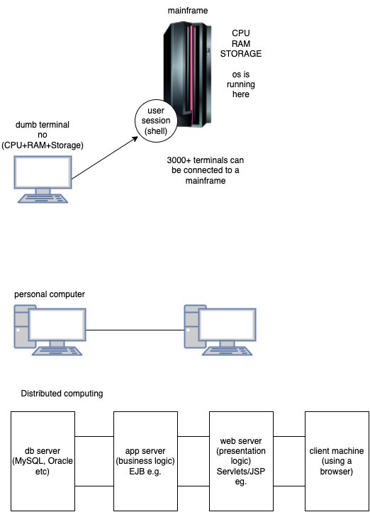
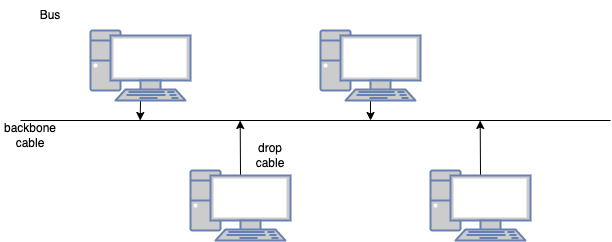
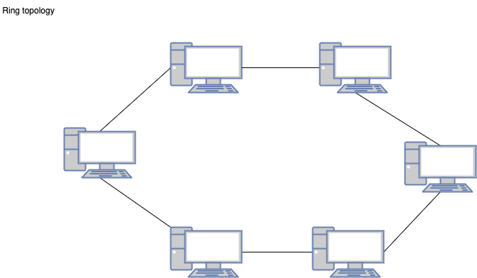
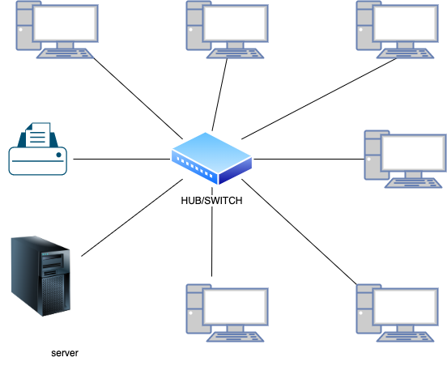
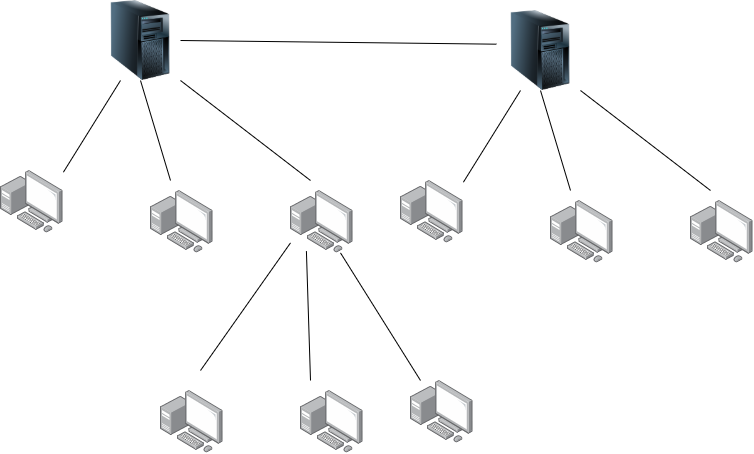
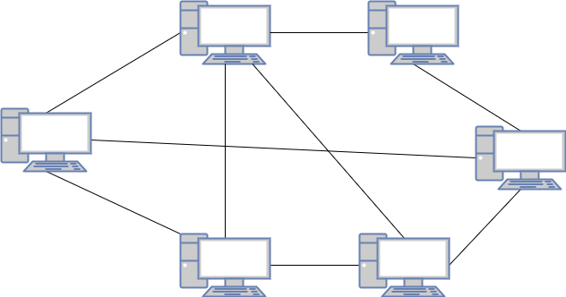
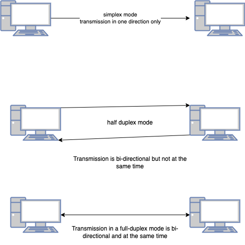
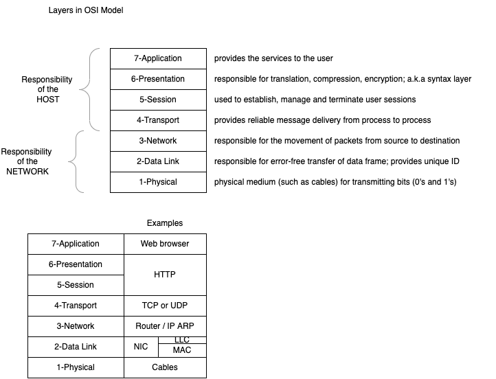

# Computer networking fundamentals



### Components of computer network

1. NIC (Network Interface card)
2. Hub
3. Switch
4. Modem (Modulator+Demodulator)
5. Router
6. Cables/connectors
    1. Twisted Pair Cable
    2. Coaxial Cable
    3. Fibre Optic Cable


### Network Topologies

1. Bus
1. Ring
1. Star
1. Tree
1. Mesh
1. Hybrid



#### Advantages of Bus topology

1. low cost cable (no hub/switch required)
1. speed of up to 10Mbps
1. simple to install and use
1. failure in one node will not impact other nodes

#### Disadvantages of Bus topology

1. extensive amount of cabling
1. damaged cable may disrupt entire network
1. troubleshooting is difficult
1. signal interference due to close proximity of cables and emf
1. reconfiguration of network is very difficult
1. attenuation - loss of signal due to length of cable. use repeaters



#### Advantages of ring topology

1. ease of network management
1. many hardware/software tools for network monitoring is available
1. cost is low
1. reliable

#### Disadvantages of ring topology

1. troubleshooting is a bit difficult
1. breakdown in one station may impact the network
1. reconfiguration of network is very difficult
1. communication delay may occur based on the cabling and the number of nodes

### Star topology



#### Advantages of star topology

1. easier troubleshooting
1. more control over network (software)
1. limited failure due to cable faults
1. adding new nodes doesn't bother existing nodes/network
1. high data speeds (supports ~ 100Mbps)

#### Disadvantages of star topology

1. central point of failure
1. cable cost

### Tree Topology

1. combination of bus and start topology



#### Advantages of tree topology

1. support of broadband transmission
1. easy expansion
1. easy manageable
1. error detection
1. point-to-point wiring

#### Disadvantages of tree topology

1. high cost
1. reconfiguration may be a bit difficult
1. fault in the main bus cable may impact the network

### Mesh topology

1. No hub/switch/router required
1. nodes are interconnected to more than one node
1. internet is an exaple of such an architecture
1. Full and partial mesh topology
    1. full -> a node is connected to all other nodes
    1. partial -> a node may not be connected to all the other nodes



#### Advantages

1. Reliable, since there are multiple acces paths
1. Faster communication, since a node can connect/communicate with another node directly

## Transmission modes

1. way in which data is transmitted from one node to another node in the network
1. a.k.a communication mode
1. transmission media (such as cable) provide a direction of communication, and hence a transmission is mode is a directional mode

Based on the direction, transmission mode is divide into 3 categories:

1. Simplex mode
1. Half duplex mode
1. Full duplex mode



## The OSI reference model

-   Open Systems Interconnection model



#### Functionalities of Data link layer:

1. Framing

```
     ---------------------------
    | Header | Packet | Trailer |
     ---------------------------
```

What DLL gets from the physical layer is only a PACKET, but it adds Header and Traler to make it a data-frame, which then is given to the network layer.

# Assignment for Day-1

-   Write your understanding of the following:
    1. A brief history of computer networking
    1. Different components involved in a computer networking
    1. Different topologies
    1. Different layers of OSI model

Please write your answers in a plain paper, take pictures of the same using your smartphone, convert them into a PDF document (using Adobe Scan mobile app) and upload the same into the shared drive. There is a folder for submission of assignments (Networking -> Assignments -> Submissions). Name your file in the format EMPNO_FIRSTNAME_LASTNAME.pdf (eg. 9876_VINOD_KUMAR.pdf).
