# Computer networking fundamentals

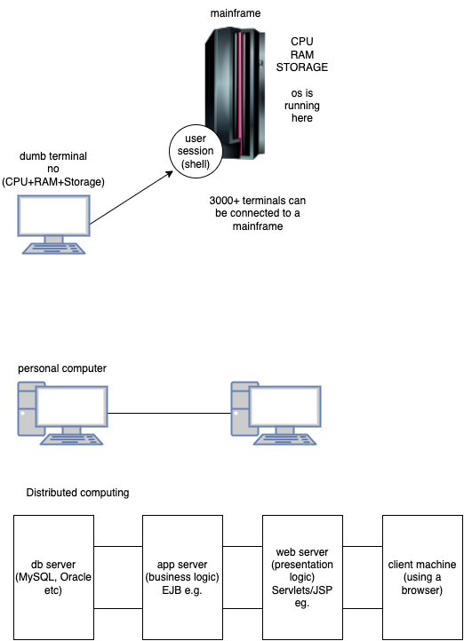

### Components of computer network

1. NIC (Network Interface card)
2. Hub
3. Switch
4. Modem (Modulator+Demodulator)
5. Router
6. Cables/connectors
    1. Twisted Pair Cable
    2. Coaxial Cable
    3. Fibre Optic Cable

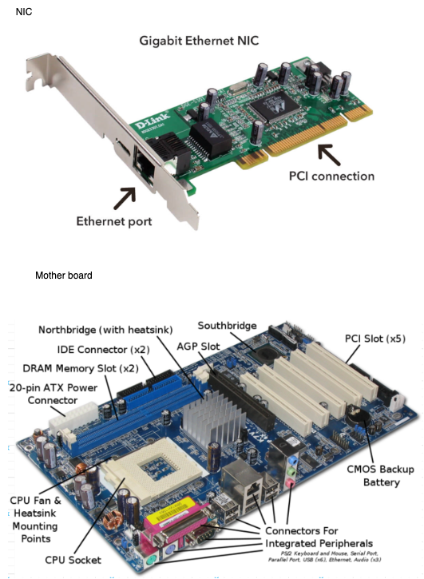

### Network Topologies

1. Bus
1. Ring
1. Star
1. Tree
1. Mesh
1. Hybrid

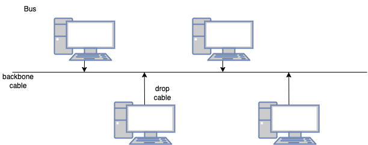

#### Advantages of Bus topology

1. low cost cable (no hub/switch required)
1. speed of up to 10Mbps
1. simple to install and use
1. failure in one node will not impact other nodes

#### Disadvantages of Bus topology

1. extensive amount of cabling
1. damaged cable may disrupt entire network
1. troubleshooting is difficult
1. signal interference due to close proximity of cables and emf
1. reconfiguration of network is very difficult
1. attenuation - loss of signal due to length of cable. use repeaters

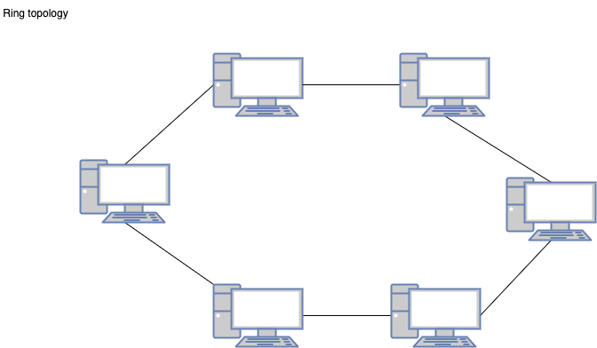

#### Advantages of ring topology

1. ease of network management
1. many hardware/software tools for network monitoring is available
1. cost is low
1. reliable

#### Disadvantages of ring topology

1. troubleshooting is a bit difficult
1. breakdown in one station may impact the network
1. reconfiguration of network is very difficult
1. communication delay may occur based on the cabling and the number of nodes

### Star topology

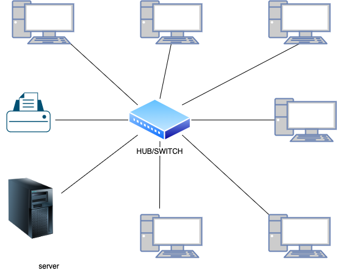

#### Advantages of star topology

1. easier troubleshooting
1. more control over network (software)
1. limited failure due to cable faults
1. adding new nodes doesn't bother existing nodes/network
1. high data speeds (supports ~ 100Mbps)

#### Disadvantages of star topology

1. central point of failure
1. cable cost

### Tree Topology

1. combination of bus and start topology

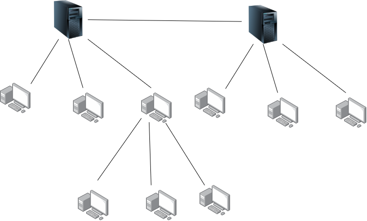

#### Advantages of tree topology

1. support of broadband transmission
1. easy expansion
1. easy manageable
1. error detection
1. point-to-point wiring

#### Disadvantages of tree topology

1. high cost
1. reconfiguration may be a bit difficult
1. fault in the main bus cable may impact the network

### Mesh topology

1. No hub/switch/router required
1. nodes are interconnected to more than one node
1. internet is an exaple of such an architecture
1. Full and partial mesh topology
    1. full -> a node is connected to all other nodes
    1. partial -> a node may not be connected to all the other nodes

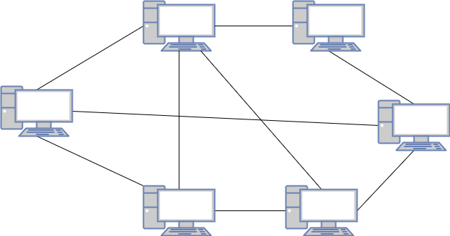

#### Advantages

1. Reliable, since there are multiple acces paths
1. Faster communication, since a node can connect/communicate with another node directly

## Transmission modes

1. way in which data is transmitted from one node to another node in the network
1. a.k.a communication mode
1. transmission media (such as cable) provide a direction of communication, and hence a transmission is mode is a directional mode

Based on the direction, transmission mode is divide into 3 categories:

1. Simplex mode
1. Half duplex mode
1. Full duplex mode

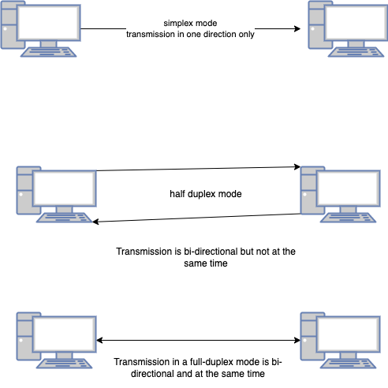

## The OSI reference model

-   Open Systems Interconnection model

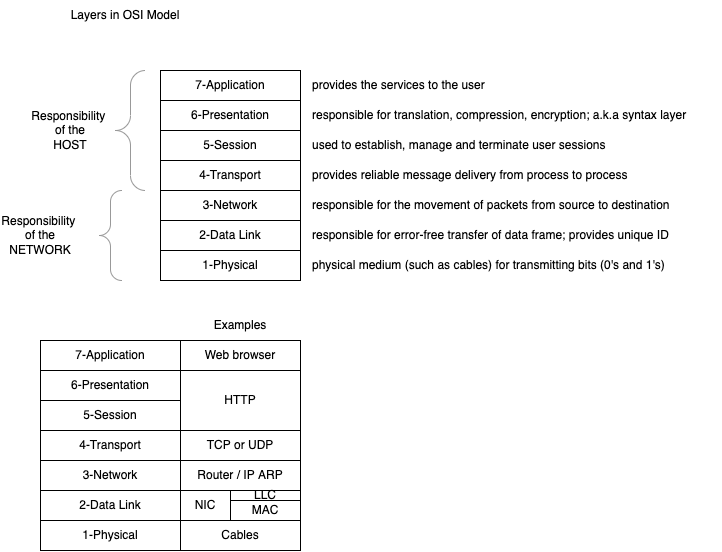

#### Functionalities of Data link layer:

1. Framing

```
     ---------------------------
    | Header | Packet | Trailer |
     ---------------------------
```

What DLL gets from the physical layer is only a PACKET, but it adds Header and Traler to make it a data-frame, which then is given to the network layer.

# References

-   https://www.inetdaemon.com/tutorials/networking/

# Assignment for Day-1

-   Write your understanding of the following:
    1. A brief history of computer networking
    1. Different components involved in a computer networking
    1. Different topologies
    1. Different layers of OSI model

Please write your answers in a plain paper, take pictures of the same using your smartphone, convert them into a PDF document (using Adobe Scan mobile app) and upload the same into the shared drive. There is a folder for submission of assignments (Networking -> Assignments -> Submissions). Name your file in the format EMPNO_FIRSTNAME_LASTNAME.pdf (eg. 9876_VINOD_KUMAR.pdf).

# Types of computer networks

1. LAN - Local Area Network
1. PAN - Personal Area Network - 25 to 30 ft
1. MAN - Metropolitan Area Network
1. WAN - Wide Area Network

## Different protocols in OSI model

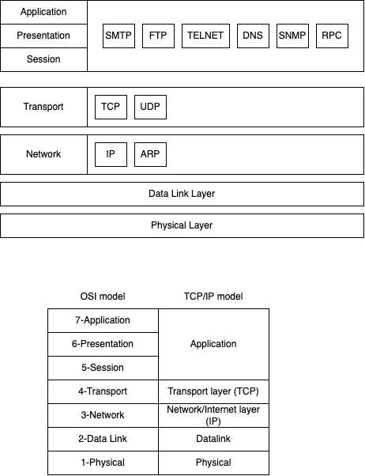

## IPv4 Packet structure

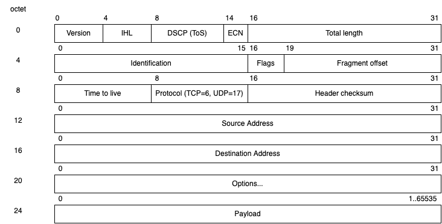

## IPv4 Addressing

-   Supports 3 types of addressing modes
    1. Unicast Addressing Mode
    1. Broadcast Addressing Mode
    1. Multicast Addressing Mode

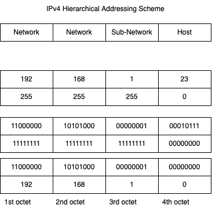

## IPv4 Address Classes

5 Classes of IPv4 address (Class A, Class B, etc)

### Class A

-   1st bit in 1st octed is always 0
-   which means you have only 7 bits for representing a number - 0 to 127
-   include 1.x.x.x to 126.x.x.x
-   default subnet mask for this class is 255.0.0.0
-   means that there can be a maximum of 126 networks
-   address format for this class would look like 0nnnnnnn.nnnnnnnn.nnnnnnnn.nnnnnnnn

### Class B

-   1st two bits of the 1st octet are going to be 10
-   address format for this class would look like 10nnnnnn.nnnnnnnn.nnnnnnnn.nnnnnnnn
-   address format for this class would look like 10nnnnnn.nnnnnnnn.nnnnnnnn.nnnnnnnn
-   10000000 - 10111111
-   128 - 191
-   Can represent up to 16384 networks and 65534 hosts

### Class C

-   1st 3 bits of the 1st octet are going to be 110
-   11000000 - 11011111
-   192 - 223
-   address format for this class would look like 110nnnnn.nnnnnnnn.nnnnnnnn.nnnnnnnn
-   upto 2^21 (2097152) networks and 254 hosts in each network

# Application Protocols

## 1. DNS

-   Domain Name System
-   Is a directory service that provides a mapping between the name of a host and the network IP
-   TLD (Top Level Domains)
    -   com (commercial)
    -   edu (educational)
    -   org (organizations)
    -   in (india)
    -   co (company)
    -   gov (government)
    -   info (informational)
    -   biz (business)

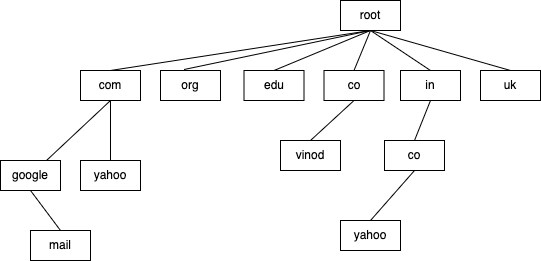

### 2. FTP (File Transfer Protocol)

-   application protocol based on TCP/IP protocol
-   bulk upload/download files to/from servers

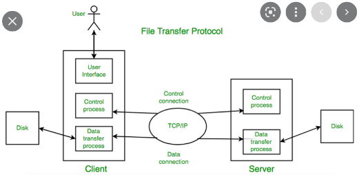

### 3. Telnet

-   Terminal Network
-   provides a connection to the remote computer
-   local terminal appears to be the window into the remote computer

### 4. SMTP

-   Simple Mail Transfer Protocol
-   Application level protocol based on TCP/IP that provides communication guidelines that allow a server software (mail server) to send emails over the internet and the client software (email clients like mail, outlook, thunderbird) to receive the emails

### 5. SNMP

-   Simple Network Management Protocol
-   Tools available that make use of this protocol to manage devices on the network
-   Monitor and manage the network

### 6. HTTP

-   HyperText Transfer Protocol
-   the default protocol used by www
-   can be used to transfer data (text/image/video etc) in plain text format or in binary format
-   based on request-response model
-   clients sent a request in HTTP standard guidelines, and the server receives, understands, and responds with content in HTTP standard format
-   A request is always initiated by the client (eg, browser, postman, http client apps written in Java/Python etc)
-   By default HTTP protocol is considered as stateless; meaning the server doesn't have any memory of previous requests by the same client
-   A request and response are considered as "messages"
-   Created by Roy Fielding

#### Structure of a "request message"

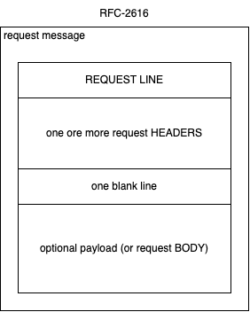

- The "Request line" consists of 3 parts
    - HTTP request method (GET, POST, PUT, DELETE, PATCH, OPTIONS, TRACE, ...)
    - Path to the resource you want to access
    - optional HTTP version
    - ex: GET /about HTTP1.1
- The headers are key and value pairs delimited by a colon
    - Most of these headers are standardised by HTTP protocol itself, but you may send custom headers as well
    - For example, 
        - Host: vinod.co
        - Authorization: Bearer asjkdhaskjdhkasdh
        - Connection: Keep-Alive
        - Accept: text/html
- Payload or request body
    - can be any text content in any format
    - will be processed by an application at the server side
    - can be sent only with POST and PUT requests


#### Structure of a "response message"

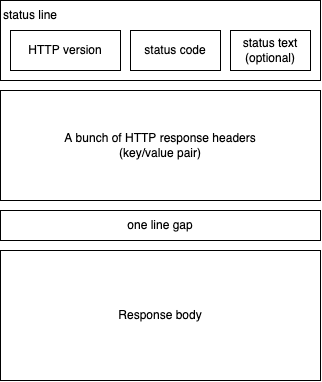