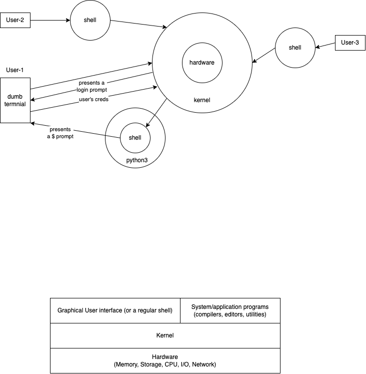
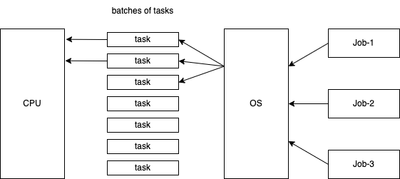
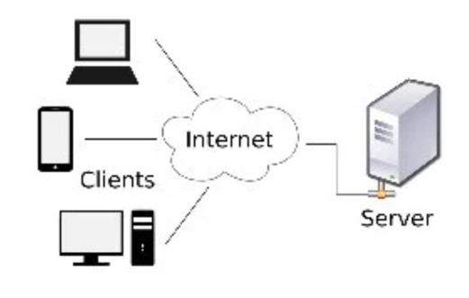
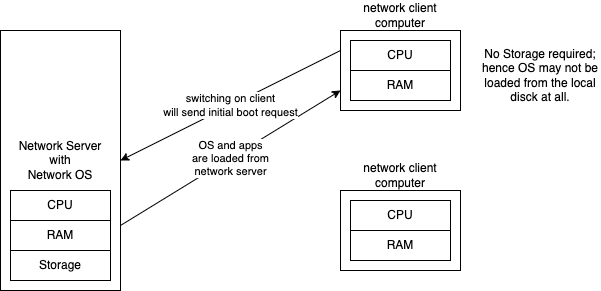
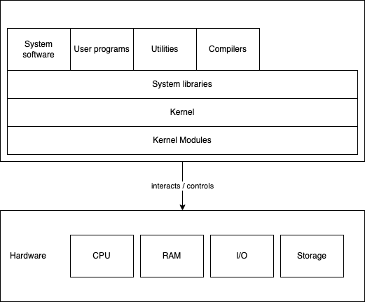
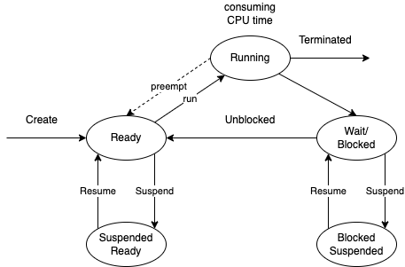
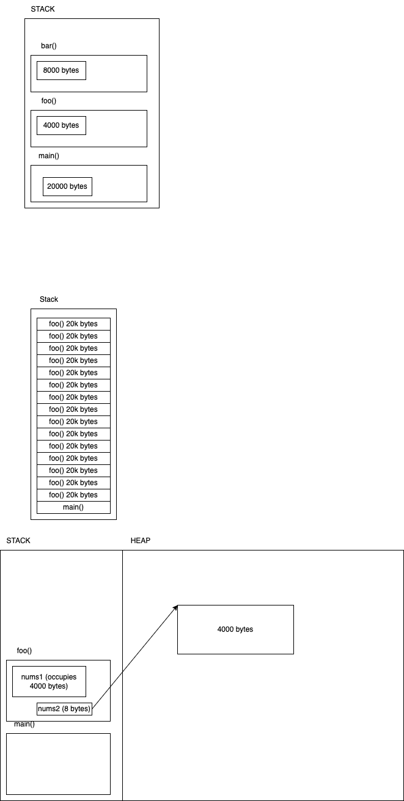

# OS Fundamentals

### MS-DOS

1. command.com (hosts a lot of internal commands)
2. config.sys
3. io.sys
4. autoexec.bat (optional)

Some useful pointers about OS

-   The first software to be loaded into the memory when your computer starts (boots)
-   It is the only program that is running at all times
-   At the core level, Kernel is the program that is loaded first
-   Kernel is the part of the OS that interacts with the hardware
-   In most OS, there will be a shell/ command interpreter loaded after kernel, which interacts with the kernel.
-   The OS takes care of
    -   memory management
    -   I/O management
    -   Network management
    -   CPU (processing) management
    -   Disk/Storage management
    -   Security management

## Generations of computers and OS (evolution)

-   First gen

    -   1945-55
    -   Vacuum tubes
    -   OS was implemented using plug boards / punch cards
        

-   Second generation

    -   1955-65
    -   Transisters
    -   Batch systems

-   Third generation

    -   1965-80
    -   IC (Integrated circutes)
    -   Multiprogramming

-   Fourth generation
    -   1980 onwards
    -   LSI (Large scale integration)
    -   OS for PCs

## Types of operating systems

-   Batch Operating System

    -   
    -   Examples of Batch OS -> Payroll System, Bank Application

-   Time-Sharing Operating System

    -   Each task is given a small amount of time (usually in milliseconds)
    -   All taks do some work with in the given amount of time, and allows other tasks to do their work
    -   At any point in time, only one task is being processed by the CPU
    -   Examples: Multics, Unix, etc

-   Distributed OS

    -   Lots of internconnected computers communicate with each other
    -   Independent computers (like yours or mine) have their own CPU/RAM
    -   
    -   Leverages computation power possessed by millions of computers in the world

-   Network OS

    -   
    -   Specialized network server os required (Novell Netware, BSD, Unix, Linux, Windows Server 2003+)
    -   Client computers connect to the network server and request for remote booting
    -   Network server sends a copy of the OS which gets loaded in the client memory

-   Real-time OS
    -   These OS serve Real-Time computers
    -   The response time for processing the input and giving the output is very very small

# Linux OS

-   Open source
-   Free
-   Was developed by Linus Towalds in 1991
-   Thousands of distro (linux distributions) are there today
-   

### Kernel

-   The core part of the OS
-   Establishes communication between software and physical devices
-   Manages resources (memory, cpu, i/o, network, storage) using device drivers

### System libraries

-   special programs that help in accessing kernel
-   provide "system calls", functions that can be triggered by an application program
    -   example: open() close() functions, that can be triggerd from with in a C program

# Process Management

-   A process is a program under execution
-   A program is a set of instructions (written in high level language, and compiled to the machine language)
-   The term "machine" refers to the OS
-   An executable program (a.k.a binary code) is a set of instructions in the machine language which can be understood and executed by the OS (actually kernel)
-   Process is an active entity
-   Program is a passive entity
-   A process has
    -   Process ID (PID)
    -   Process Status (ready, running etc)
    -   CPU Registers (memory inside the CPU)
    -   I/O status information
    -   CPU Scheduling information (such as priority information)
    -   Accounts information (user, group etc)

## Different states of a Process

-   New
    -   You just ran or executed a program
    -   OS creates a running process for the same (with ID etc)
-   Ready
    -   After creation, process by default moves to this "Ready" State
    -   The process is ready for execution
    -   It is waiting since there is only one process being handled by the CPU (Single core)
-   Run
    -   CPU is executing the instructions of the process
    -   There will be time cap as how long a process is handled by the CPU
    -   If the task of the process is not finished with in the allotted time, it will go back to the Ready state
-   Wait (or Block)
    -   A process becomes blocked, when it demands I/O access
    -   Once blocked, it can not be resumed to the Run state, but it will go back to the Ready state, and waits for its turn to get the CPU time
-   Completed (or Terminated)
    -   The entire task of the running program is finished, and the process quits
-   Suspended Reday
    -   When the "ready-queue" is full, some processes are moved to another queue which is called "Suspended ready"
-   Suspended Block
    -   When the "block/wait-queue" is full, some processes are moved to another queue which is called "Suspended block"

### Context Switching

-   Process of saving the context (information about the state of the process like data held by the process, etc) of running process and loading the context of one of the "Ready" process next in queue (for executing by CPU)
-   happens when
    -   when a high-priority process comes to the ready state
    -   Interrupt occurupt
    -   Preemptive CPU Scheduling used

# Divisions of memory

-   During the execution of a program (process), the program stores data in the form of memory variables
-   Variables declared inside a function (including parameters/arguments) (a.k.a local variables) are stored in STACK
-   A program a may request the OS for extra memory, dynamicall, based on the requirements at the runtime. Such memory is allocated in HEAP
-   The code itself (during execution) is stored in CODE SEGMENT

# Assignment for Day 1

Do a bit of research about CPU scheduling and address the following tasks:

1. Write about CPU Scheduling in Operating Systems
2. What are the different types of CPU Scheduling Algorithms?
3. Explain in detail about Round Robin Scheduling Algorithm

As in the past, please write your content on a paper, and submit the PDF version of the same in the submission folder.

# Linux Commands

-   Case sensitive
-   Most commands are in lowercase
-   Use the `man` command for getting help on any command

1. clear
    - clears the terminal
    - ctrl+k (windows/linux) cmd+k (macos)
1. echo
    - prints the text given or the content of the environment variable (if prefixed with $)
1. export
    - creates a new environment variable
    - export MY_NAME="Vinod Kumar"
    - export MY_CITY=Bangalore
    - echo $MY_NAME welcomes you to $MY_CITY
    - do not give space in the assignment expression (around the = symbol)
1. env
    - to list all the environment variables
    - can also be used to remove all the environment variables by using the -i flag
        - env -i bash
        - clears all user exported environment variables and starts a snew bash session with default values
        - not a recommended one
1. unset
    - removes the specified environment variable
1. pwd
    - prints working directory
    - by default when the user logs in, they will be in thir `home` directory
    - home directory can be set/identified using the environment variable `HOME`
    - to view the content of any environment variable, use the `echo` command
        - echo $HOME
        - note the $ symbol prefix for the environment variable
1. touch
    - updates the timestamp of the file specified
    - if the file does not exist, a new one will be created with no content
    - creates a zero byte file
1. ls
    - short form for `list`
    - lists files and directories in the working directory (if not specified)
    - `ls -l` wide list of files and directories
        - the first letter in the output for each file indicates the type of the file
            - `-` means it is a regular file
            - `d` means it is a directory
            - `l` means it is a link (similar to (but not exactly) shortcut in Windows)
        - the letters from 2 to 10 indicate the permissions given to user/group-member/others on the file/directory
            - rwxrwxrwx format
            - r->read, w->write, x->execute
            - r->4, w->2, x->1
        - column 2 indicates the number of links
        - colums 3 and 4 indicate the name of the user who crated the file and the name of the group to which the user belongs to
        - column 5 indicates the size of the file in bytes
        - column 6 indicates the timestamp
            - `Mar 15 10:01`
        - column 7 is the name of the file/directory
    - `ls -a` lists all files including hidden files (a file whose name starts with a dot is a hidden file)
    - `ls -A` lists all files including hidden files excluding . and ..
        - combine with -l option to get the long list of files/directories
        - `ls -la` or `ls -lA`
1. mkdir
    - make directory
    - directory (or a.k.a folder in Windows) is a container of files and directories
    - can create multiple directories simultaneously
        - mkdir java_project cpp_project python_project
    - can create an entire tree of directories and subdirectories using the `-p` flag
        - mkdir -p unix_training/day1/commands unix_training/day1/scripts
1. tree

    - to view the hierarchy of directories and files in a visual mode

1. mv

    - can be used for moving a file from one location to another location
    - can also be used for renaming a file or directory

1. cp

    - copy one or more files to same or a different location
    - Examples:
        - `cp Hello.js Hi.js` Makes a copy of Hello.js as Hi.js in the same location
        - `cp Hello.js react_project/Welcome.js` Makes a copy of Hello.js in the current directory to react_project directory with a new name
        - `cp *.js ./js_files` Copy all JS files to a folder called `js_files`
        - `cp -r java_project cpp_project my_projects` copies `java_project` and `cpp_project` folders and their content into the target folder `my_projects`. This is possible because of the `-r` flag.

1. rmdir

    - removes an empty directory
    - to remove directories which are not empty use the `rm -r` command

1. rm

    - remove one or more files
    - `rm Hello.js Hi.js`
    - `rm -r my_projects` deletes the entire tree of file and directories inside `my_projects` including the same.
    - dangerouse and should be avoided

1. locate

    - locates a files in a linux filesystem
    - `locate *.java`
    - Since it searches the entire filesystem, sometimes this would a time taking task

1. cat

    - short for catenate
    - displays the content of the file specified
        - `cat hello.txt`
        - `cat /etc/passwd`
    - can also be used for creating a new file
        - `cat > readme.md`
        - after typing the content (or pasting from clipboard), prese `CTRL+D` to save and exit

1. more

    - similar to cat, but displays the content pagewise
    - press ENTER/RETURN key to foward one line at a time
    - press SPACEBAR to view the next page content
    - press `q` to quit
    - `more /etc/passwd`
    - can also take input from the output of another command
        - `ls -l /usr/bin | more`
        - output from the `ls -l /usr/bin` is fed as input to the `more` command

1. head and tail

    - `head` displays the top 10 lines from a file (or an input coming through the pipe)
        - `head /etc/passwd`
        - `ls -l /usr/bin | head`
    - `tail` displays the bottom 10 lines from a file (or an input coming through the pipe)
    - use -n flag (where n is an actual number) to control the number of lines
        - e.g, `head -15 /etc/passwd` will show first 15 lines from the specified file

1. cal

    - displays the calendar for the current month of the current year
    - `cal 2022` displays the calendar for the entire year 2022
    - `cal 8 2002` displays the calendar for August 2002

1. ping

    - checks the connection from your computer to a different computer on the network (or internet)
    - `ping -c 5 vinod.co` tries to ping 5 times to the server `vinod.co`

1. hostname

    - displays the name of the computer
    - the flag `-I` displays the IP address instead of the name

1. uname
    - displays the information about the Linux
    - the flag `-a` gives more information
    - To get more detailed information about the OS use the command `cat /etc/os-release`

# Vi IMproved (VIM editor)

-   Different modes

    -   Normal mode (press escape couple of times to ensure you are in the normal mode)
    -   INSERT mode (allows the user to type text)

-   Settings:
    -   Can be saved in a file under the home directory called .vimrc
    -   set number
        -   sets the line number
    -   set mouse=a
        -   allows the use mouse to place cursor where ever needed
    -   set autoindent
        -   New lines inherit the indentation from the previous line
    -   set tabstop=4
        -   Tab is same as 4 spaces
    -   colorscheme blue

### In the NORMAL mode we can do editing operations

-   add a new line after the current line
    -   o
-   add a new line before the current line
    -   O
-   insert characters at the current cursor position
    -   i
-   insert characters at the start of the current line
    -   I
-   copy an entire line
    -   yy (yank or copy a line)
    -   2yy (copy 2 lines, instead of 2 use any other number for those many lines)
-   copy a word (letters from the current cursor position)
    -   yw
-   cut a line
    -   dd
    -   2dd (delete 2 lines from the current line, instead of 2 use a different number to delete those many lines)
-   cut a word
    -   dw
-   paste from clipboard
    -   p (lowercase pastes in the line below the current line)
    -   P (uppercase pastes in the line above the current line)
-   undo
    -   u
-   redo
    -   R
-   visual mode
    -   v
        -   start visual mode, mark text for doing cut/copy operations
    -   V
        -   start linewise visual mode
