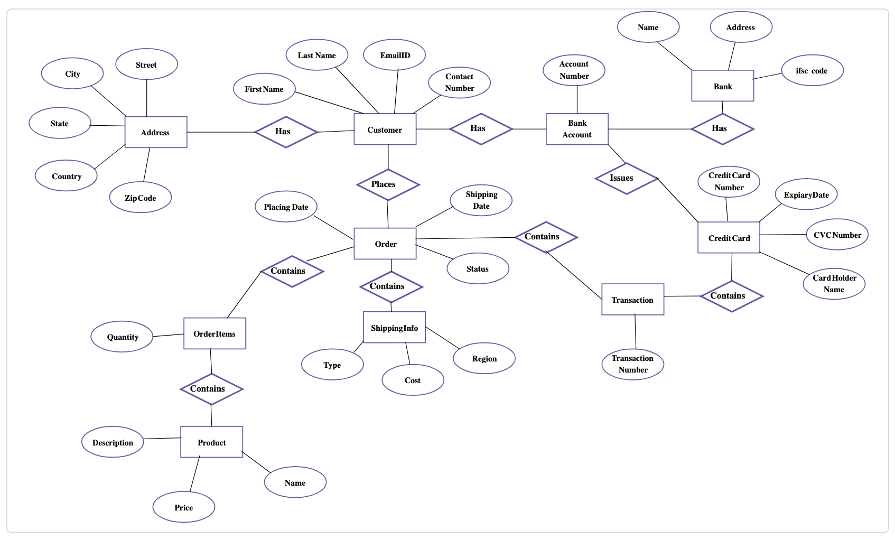
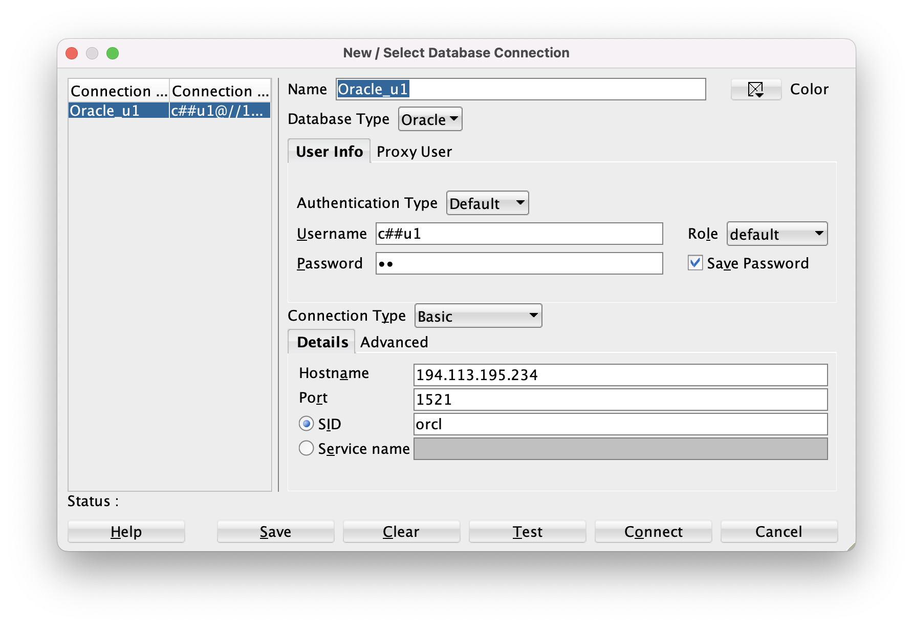
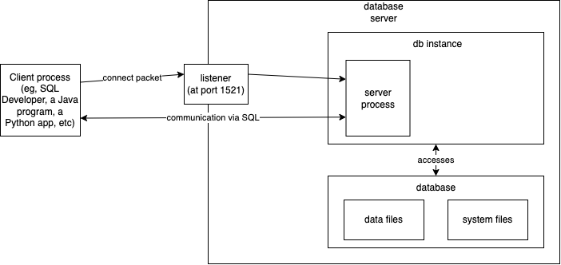
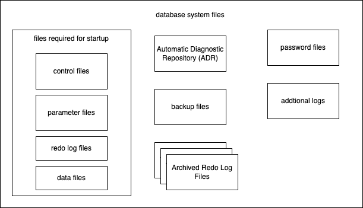
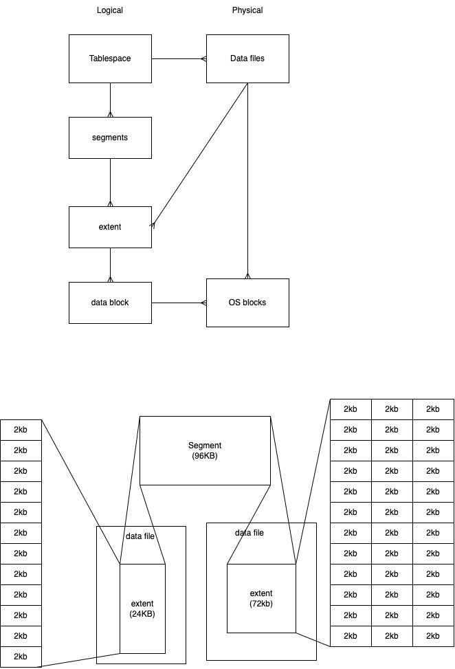
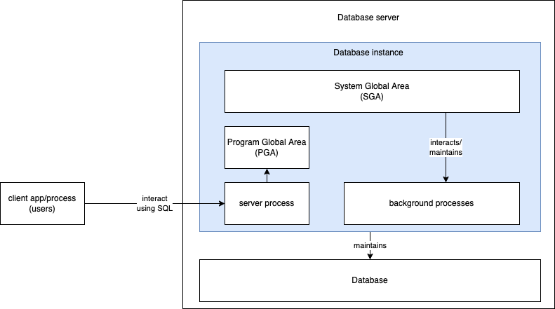
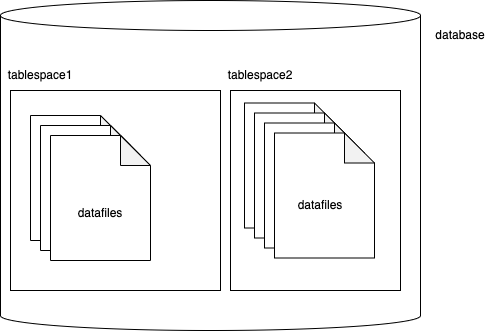

# RDBMS concepts and SQL

### Assignment

1. Read through the slides 53 to 74 (from DBF.pdf), try and understand the concept of Normalization, which is helpful in fine tuning the tables crated from ER diagrams
1. Convert the ER diagrams in the DBF_ER_Assignment_Solution.pdf into tables (relation)
1. Convert the following ER diagram into tables (relations)



### To connect to the Oracle server using SQL Developer, use the following details:

-   Host: 194.113.195.234
-   Port: 1521
-   SID: orcl
-   Username and Password as listed in the PDF



### Slides to read for SQL Select operations

128 - 163

### Assignment on SQL Selectio statements

-   Refer to the <a href="./Assignment_on_SQL_Queries.pdf">Assignment_on_SQL_Queries.pdf</a> and complete the questions from 1 to 40.

# Oracle Database Architecture

-   Oracle is an OR-DBMS

Oracle RDBMS consists of

-   At least one database Instance
    -   combination of memory and processes, part of the running oracle installation
    -   It is also a background process (service) listening to client requests on a server machine
-   Database
    -   set of files to store data



### Physical Storage Structures

When `create database` command is executed, following files are crated.

-   Data files
    -   contains actual/real data
    -   tables, indexes etc are physically stored in these data files
-   Control files
    -   contains metadata
    -   describes physical structure of the db inlcuding db name, table name ,table structure, location of the data files etc
-   Online redo log files:
    -   maintains entries for every change made to the database and its content



### Logical Storage Structures

-   Data blocks
    -   data is stored in blocks (say around 2kb)
-   Extents
    -   a collection of blocks
    -   specific number of logically contiguous data blocks used to store the particular type of information
-   Segments
    -   a collection of logically related extents
    -   eg, table or index
-   Tablespaces
    -   a db is divided into logical storage units called tablespaces
    -   logical container/grouping of segments
    -   each tablespace consists of at least one data file



## Database instance

-   It is a service running in your OS
-   Acts like an interface between the client process (users) and the database
-   Contains mainly 3 parts:
    -   SGA: System Global Area
        -   Shared memory structure allocated when the system starts up, and released when the system shuts down.
        -   Contains data and control information for one db instance
    -   PGA: Program Global Area
        -   is available to all processes
        -   is a private memory area allocated to each client session, when the session starts and released when the session ends.
    -   Background processes
        -   PMON
            -   Process Monitor
            -   regulates all processes
            -   cleans up all unwanted/broken db connections
            -   registers a db instance with the listener process
            -   always alive in the db server
        -   SMON
            -   System Monitor
            -   performs system level cleanup operations
            -   responsible for auto-recovery in case of system failure
        -   DBWR
            -   Database Writer
            -   Writes the state of memory as far as db data is concerned, to the secondary storage
            -   has many writers, DBWR0, DBWR1, DBWR2, ...
        -   CKPT
            -   checkpoint processes
            -   Data in the disk is called a block, and data in the memory is called buffer
        -   LGWR
            -   Log Writer
            -   Every bit of change to the db is written the redo log files
        -   ARC
            -   Archiver process
            -   Archives content of redo log files into arched-redo-log files
        -   MMON
            -   Manageability Monitor
            -   Gathers performance related metrics
        -   MMan
            -   Memory Manager
            -   Manages various aspects of Oracle's memory



## Tablespace

-   Oracle divides a database into one or more logical storage units called tablespaces
-   each tablespace consists of one or more files called datafiles



```sql


CREATE USER C##VINOD1
    IDENTIFIED BY topsecret
    DEFAULT TABLESPACE USERS;


DESC DBA_USERS;
SELECT USERNAME, USER_ID, CREATED, AUTHENTICATION_TYPE
    FROM DBA_USERS;

GRANT CREATE SESSION TO C##VINOD1;
GRANT CREATE TABLE TO C##VINOD1;
ALTER USER C##VINOD1 QUOTA UNLIMITED ON USERS;
GRANT SELECT ANY TABLE TO C##VINOD1;
GRANT SELECT ON C##U1.EMPLOYEES TO C##VINOD1;

GRANT INSERT, UPDATE ON C##U1.EMPLOYEES TO C##VINOD1;

REVOKE INSERT, UPDATE ON C##U1.EMPLOYEES FROM C##VINOD1;
REVOKE SELECT ANY TABLE FROM C##VINOD1;
REVOKE CREATE SESSION FROM C##VINOD1;

REVOKE ALL PRIVILEGES FROM C##VINOD1;

DROP USER C##VINOD1 CASCADE;


```

## Roles

-   a role a group of privileges
-   assign all the required privileges to a role and then assign the role to multiple users
-   more efficient way of handling privileges

```sql
    CREATE ROLE <ROLENAME>
    [IDENTIFIED BY <password>];
```

Once the role is created grant privileges to the role, just the way you do it for user.

```sql

    GRANT INSERT, UPDATE ANY TABLE TO ROLE1;

    GRANT ROLE1 TO USER1;
```

# Assignments for 22-Jul-2022

1. Explain the following abbreviations:
    - DDL, DML, TCL, DCL, DRL/DQL
2. Explain the roles and responsibilities of a DBA
3. Explain the Oracle commands involved in User Management
4. Explain the following concepts:
    - Tablespace
    - Redo file management
    - Control files

Please write your answers in a plain paper, take pictures of the same using your smartphone, convert them into a PDF document (using Adobe Scan mobile app) and upload the same into the shared drive. There is a folder for submission of assignments **(OracleDBA -> Assignment_Submissions)**. Name your file in the format EMPNO_FIRSTNAME_LASTNAME.pdf (eg. 9876_VINOD_KUMAR.pdf).
