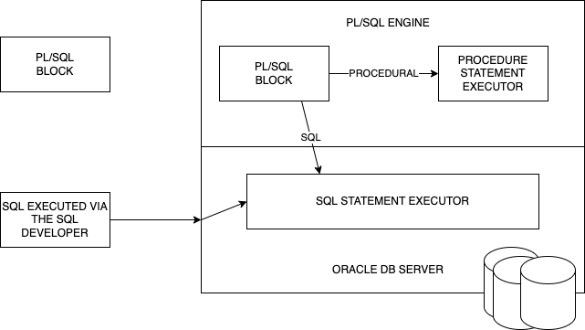

# PL/SQL

Procedure Language / Structured Query Language



Typical PL/SQL block looks like this:

```

DECLARE
    -- DECLARE VARIABLES, ALLOCATE MEMORY FOR CURSOR
BEGIN
    -- PERFORM SQL AND NON-SQL (PROCEDURAL) OPERATIONS
EXCEPTION
    -- IN CASE OF AN ERROR, THIS BLOCK MAY HAVE STATEMENTS
    -- TO HANDLE THOSE ERRORS
END;
/

```
